# mysql-workbench  🐬
## **Creacion  base de datos de  dos entidades y  consultas sql.**
## *Trigger
## *Procedimientos Almacenados

>> **lamarden.sql**

___
## Imagen 1
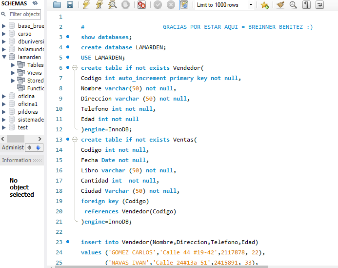

___
## imagen 2
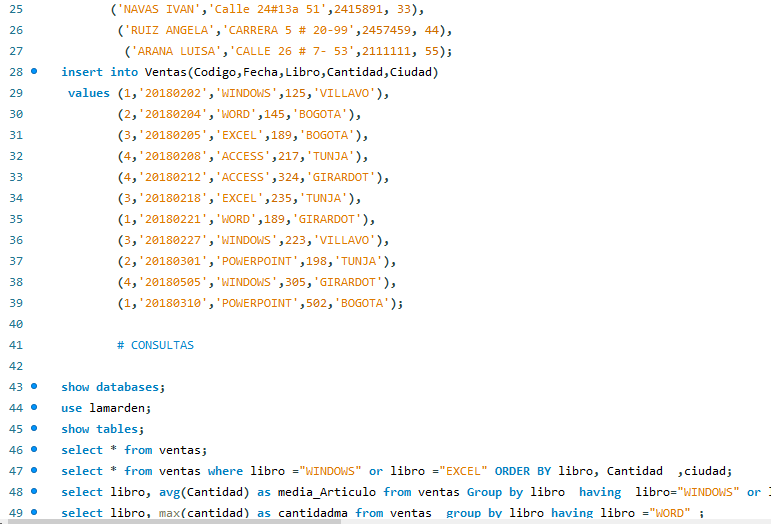

___
## imagen 3
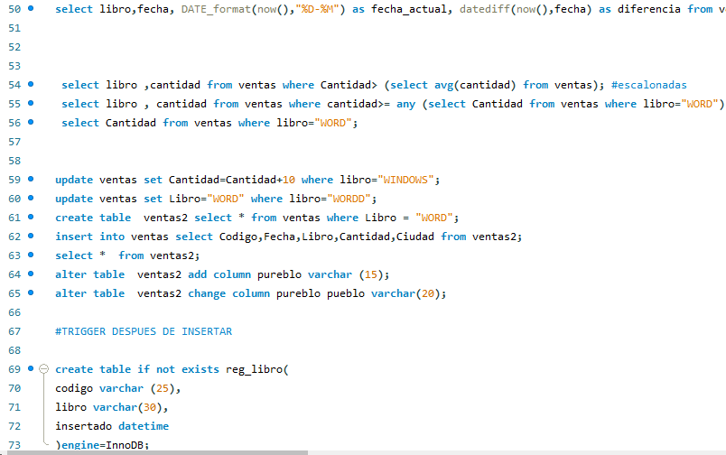

___
## imagen 4
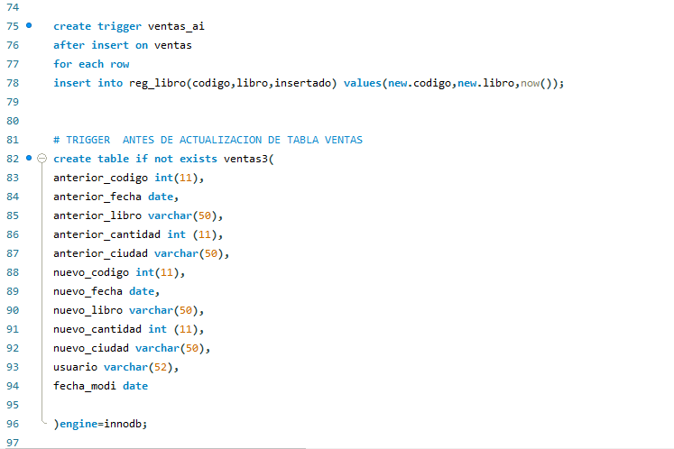

___
## imagen 5
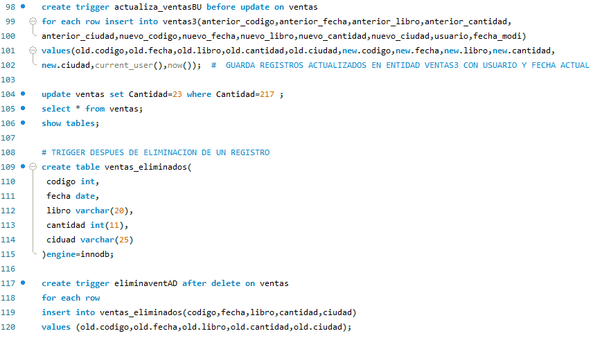

___
## imagen 6
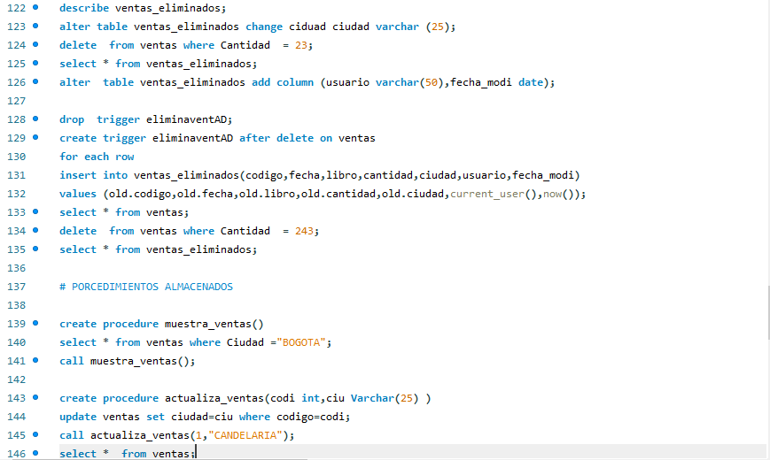

___
## imagen 7
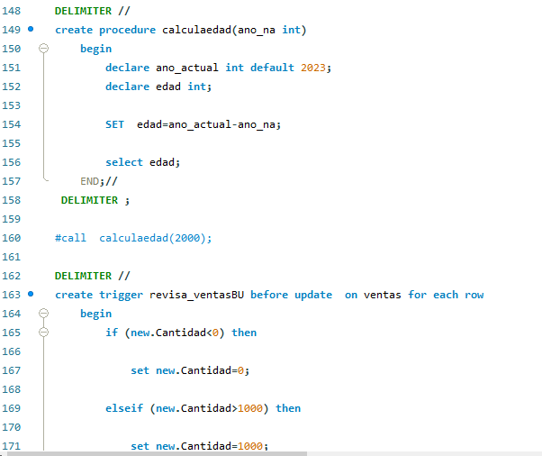

___
## imagen 8
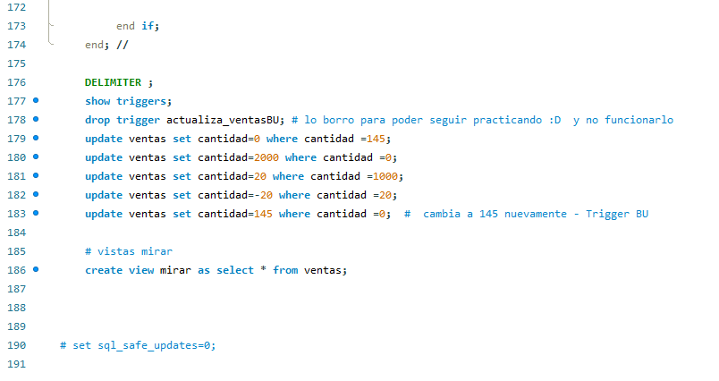

_

# HOLA MUNDO 
## holamundo.sql  

___
## imagen 1
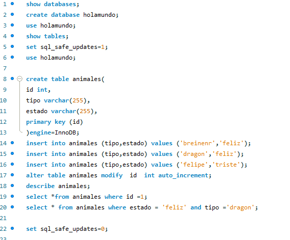

___
## imagen 2
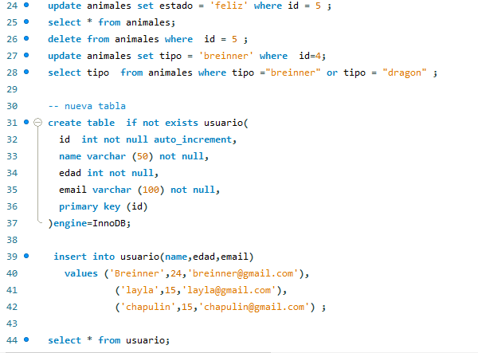

___
## imagen 3
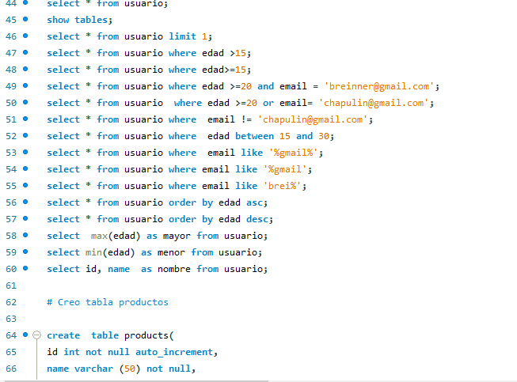

___
## imagen 4
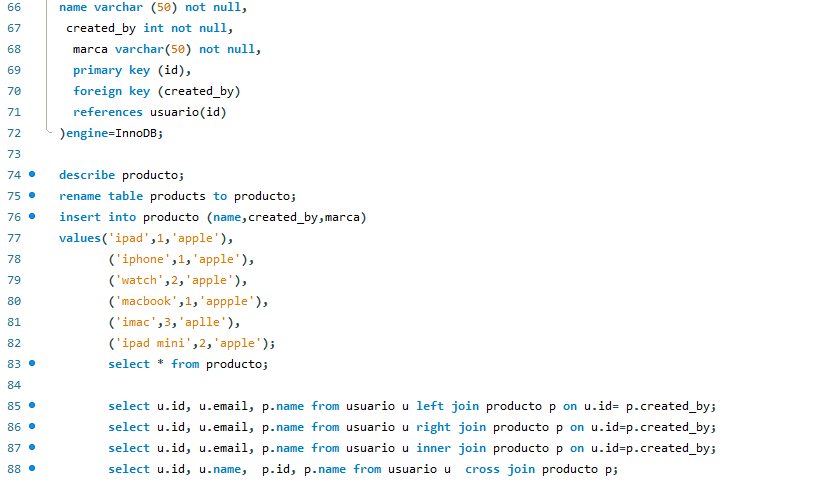

___
## imagen 5
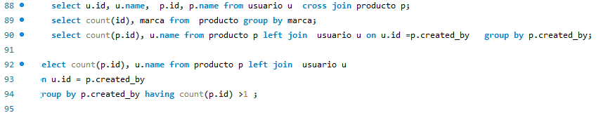

